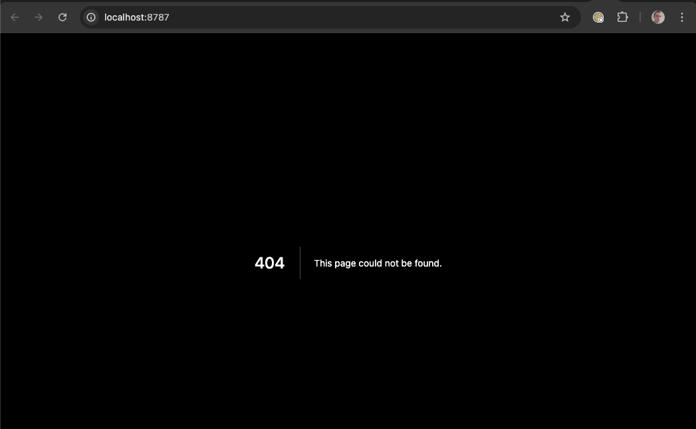

# open-next-15-404-experimental-repro

This is a simple reproduction that shows that the current `@opennextjs/cloudflare` (experimental) doesn't support Next.js 15.

The build succeeds but at runtime the index route 404s:

## Reproduction steps

To reproduce the issue:

- run `npm i`
- run `npm run preview`
- navigate to the app's local url to see the 404 page
